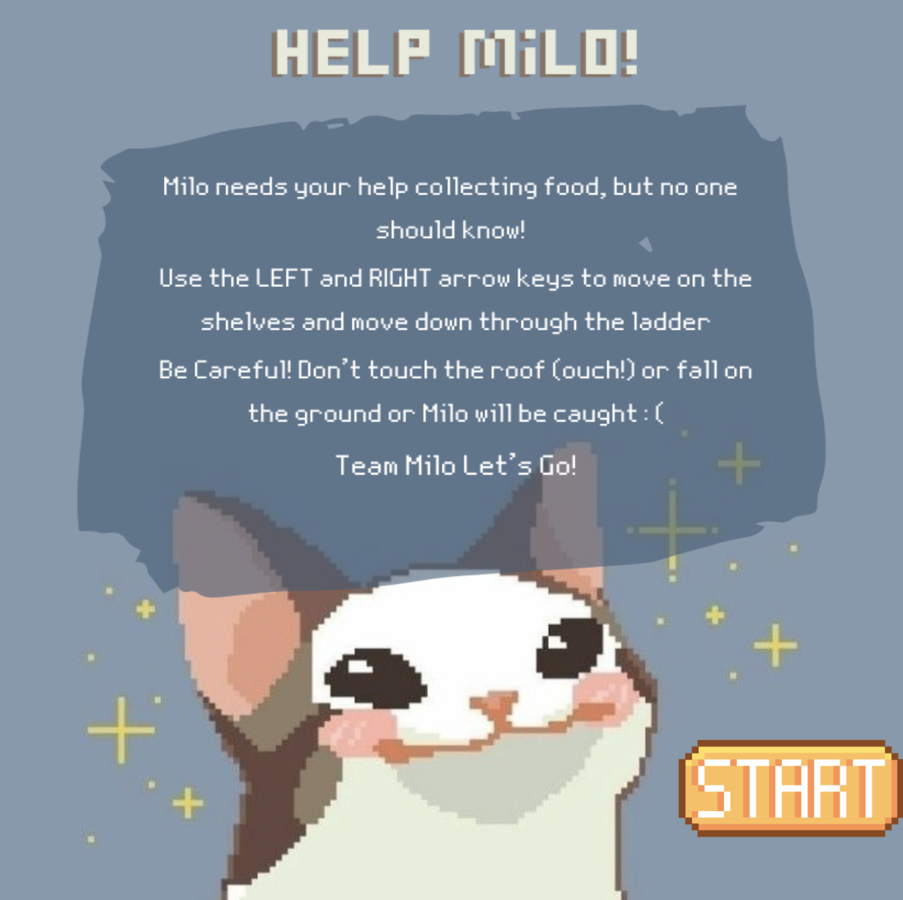
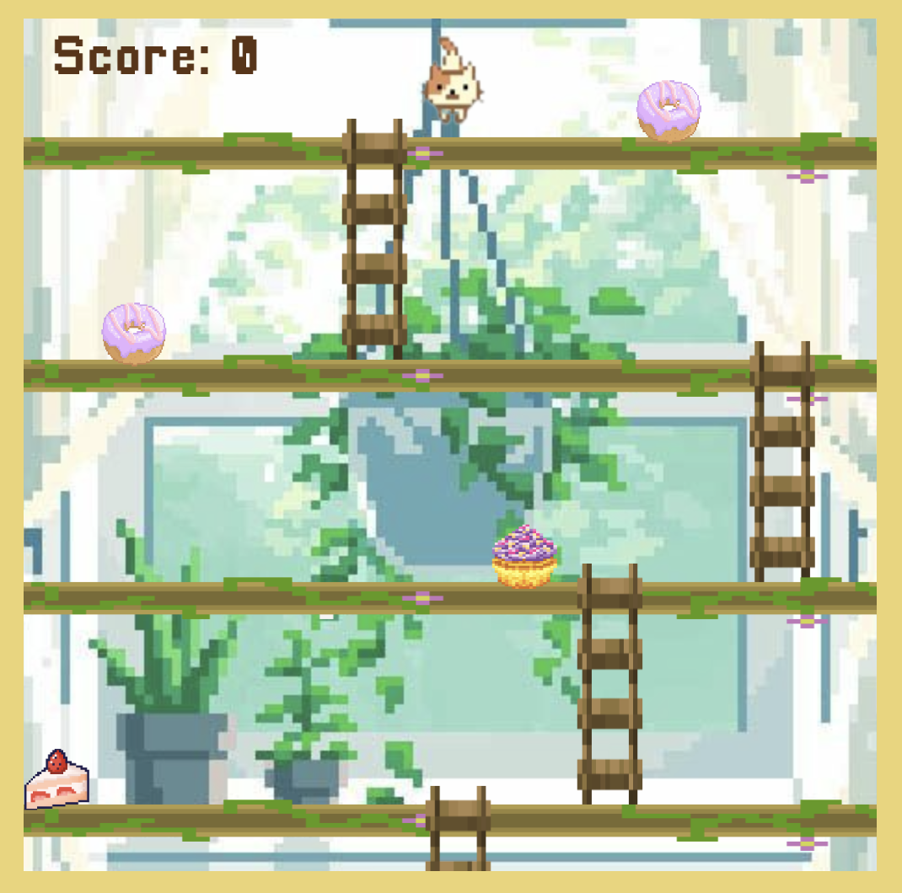
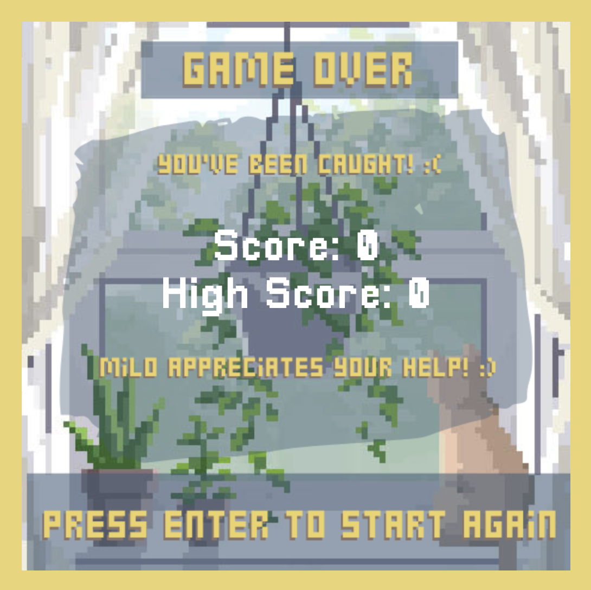

# Highscore Cat Game

A simple game created using p5.js where the player controls a cat to maneuver between ladders, catch food while falling to increase points, and avoid falling or touching the ceiling.

## How to Play

- Use the arrow keys to move the cat left or right.
- Maneuver between ladders to catch falling food items.
- Each caught food item increases your points.
- Be careful not to fall off or touch the ceiling.

## Screenshots or Demo

## Technologies Used

- [p5.js](https://p5js.org/) - A JavaScript library for creative coding.

## Features

- Object-oriented programming using classes in p5.js.
- Dynamic rendering of falling food, cat player, and ladders.
- Scoring system to keep track of the player's performance.

## How to Run

1. Open the [Live Sketch](https://editor.p5js.org/kk4597/full/GdGqXZYpt).
2. Interact with the game using arrow keys.

## Contributions

Contributions are welcome! Feel free to submit issues or pull requests.

## License

This project is licensed under the [MIT License](LICENSE).
