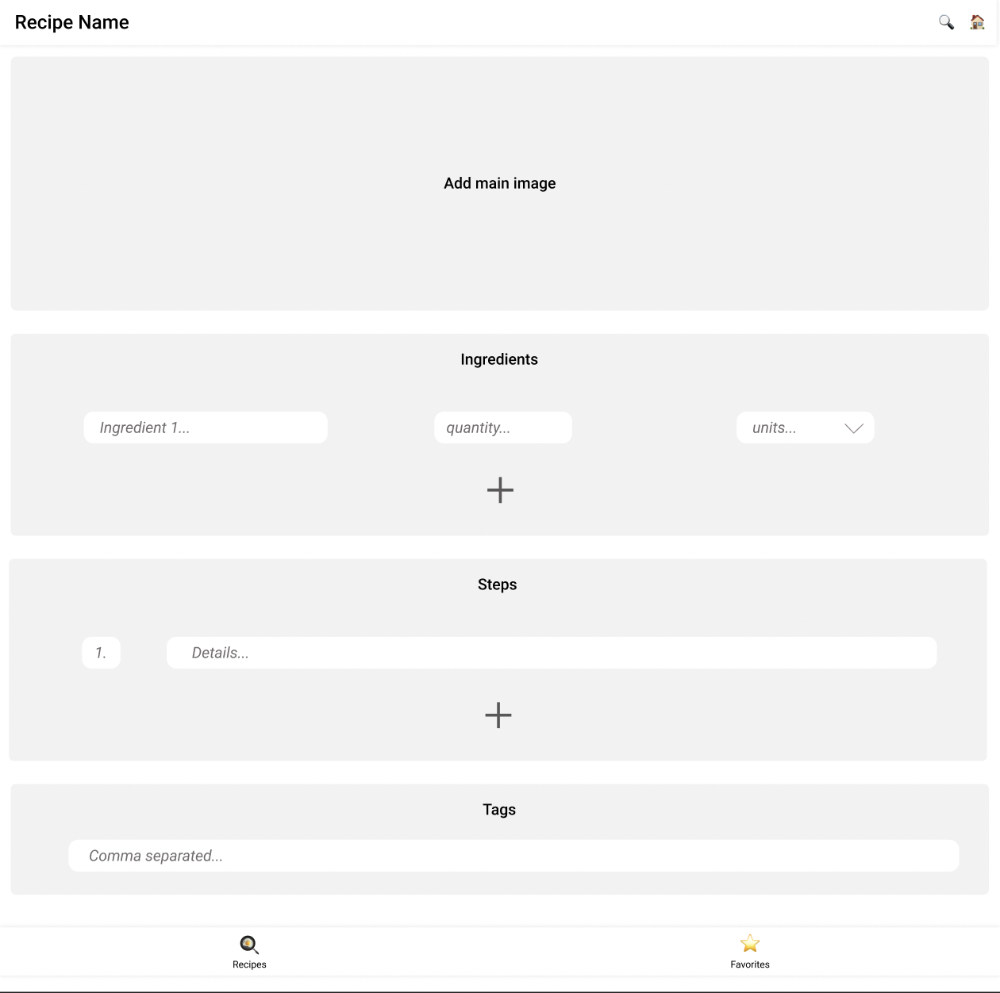
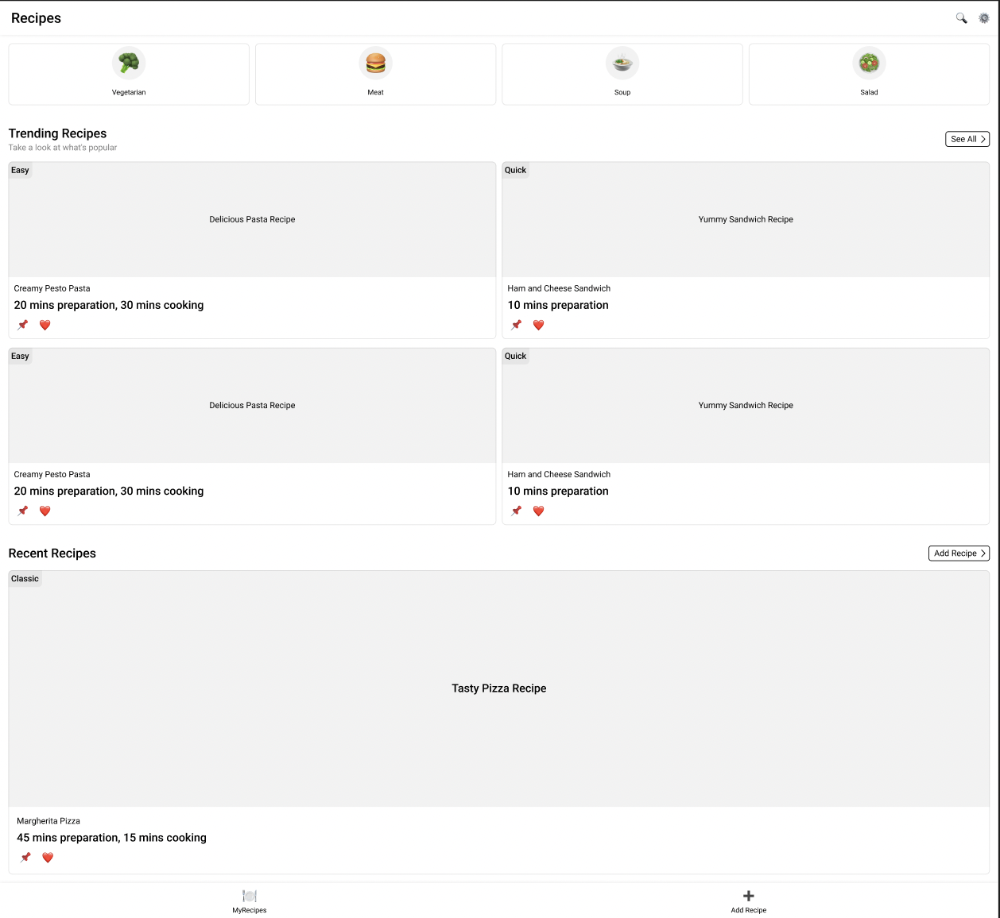
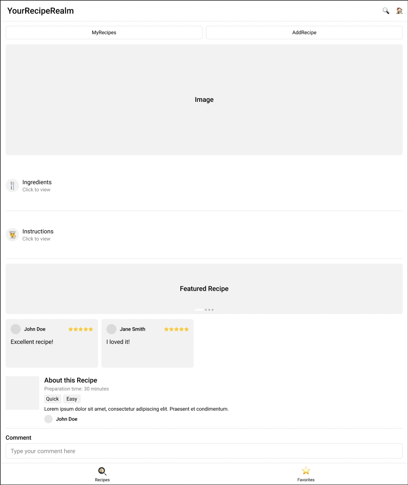
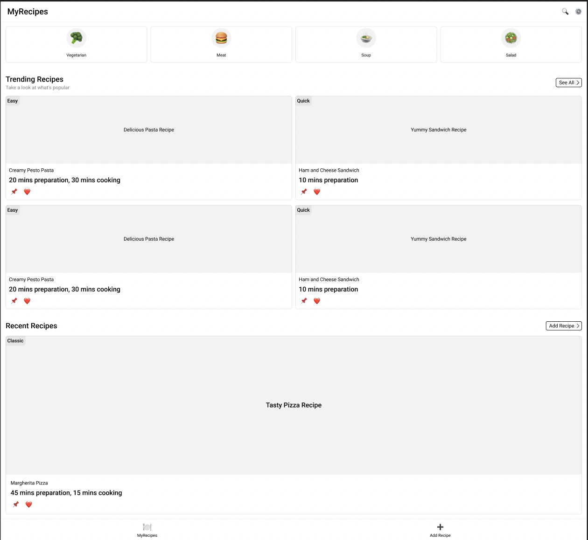
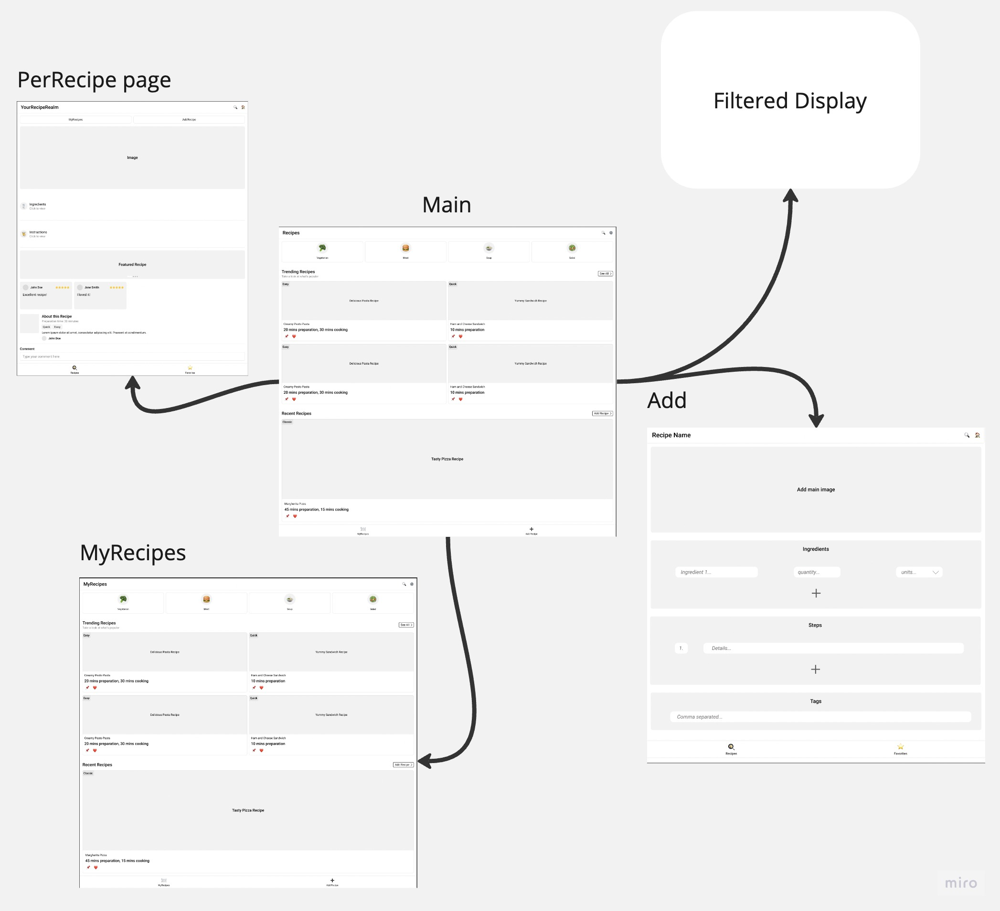

# RecipeRealm

## Overview

Introducing RecipeRealm, your ultimate culinary companion in the digital realm! RecipeRealm is a user-friendly web platform designed for passionate home cooks and food enthusiasts who want to organize, share, and explore a universe of delightful recipes. With RecipeRealm, users can effortlessly input their favorite recipes by specifying ingredients, units of measurement, and step-by-step descriptions. The platform empowers users to upload images, ensuring a visual feast for every recipe. What sets RecipeRealm apart is its intelligent sorting system, meticulously categorizing recipes based on ingredients, tags, and descriptions.

 The platform's sleek interface not only standardizes the data but also displays recipes in a visually appealing and consistent manner. On the main page, users can explore a diverse array of recipes, each represented by a captivating icon leading to a dedicated page. Additionally, RecipeRealm offers a personalized experience with a 'My Recipes' section accessible through user-specific IDs, allowing individuals to manage their creations effortlessly. With advanced filtering options, users can discover recipes tailored to their preferences. RecipeRealm transforms the art of cooking into a seamless, interactive, and delightful experience for food enthusiasts of all levels!


## Data Model

In RecipeRealm, the application stores Users, Recipes, and Ingredients.

* Users can create multiple recipes (via references).
* Each recipe can have multiple ingredients (by embedding).

An Example User:

```javascript
{
  username: "chefextraordinaire",
  password: // a password hash,
  email:
  recipes: // an array of references to Recipe documents
}
```

An Example Ingredient:

```javascript
{
  name: "Pasta",
  quantity: 250,
  unit: "grams",
};
```

An Example Recipe with Embedded Items:

```javascript
{
  name: "Delicious Pasta",
  description: "A mouth-watering pasta dish",
  ingredients: [mongoose.Types.ObjectId()], // You can replace mongoose.Types.ObjectId() with actual ObjectId values
  instructions: [
    { stepNumber: 1, description: "Boil pasta in a pot of salted water" },
    { stepNumber: 2, description: "Saute garlic and onions in olive oil" },
    // Add more steps as needed
  ],
  tags: ["Italian", "Pasta", "Dinner"],
  photos: [{ dataUrl: "https://example.com/pasta.jpg" }],
  comments: ["Yum!", "Can't wait to try this!"],
};

```


## [Link to Commented First Draft Schema](db.mjs) 


## Wireframes


/addrecipe - This page serves as the hub for creating new recipes. Users can input the name of the recipe, a brief description, and attach images to showcase the dish. For adding ingredients, there are input fields for ingredient names, quantities, and optional units. Users can dynamically add multiple ingredients by clicking an "Add Ingredient" button. Additionally, there's a section for step-by-step instructions where users can input detailed cooking directions. Once the recipe is complete, users can save it by clicking the "Create Recipe" button.



/main - This page displays a collection of all recipes submitted by users. Each recipe is represented as a card, featuring the recipe name, a brief description, and a thumbnail image. Users can browse through the recipes and click on a card to view the full recipe details. Additionally, there are filtering options allowing users to sort recipes based on tags.



/recipe/slug - This page showcases the detailed view of a specific recipe. Users can see the recipe name, description, ingredients with quantities and units, step-by-step instructions, and accompanying images. The page provides a cohesive layout, allowing users to follow the recipe seamlessly. There's also an option for users to add comments on that recipe.




## Site map



## User Stories or Use Cases

1. As a non-registered user, I can create a new account on the RecipeRealm website, allowing me to save and share my favorite recipes.

2. As a registered user, I can log in to my RecipeRealm account to access personalized features and manage my saved recipes.

3. As a user, I can create a new recipe, providing details such as the recipe name, description, ingredients with quantities and units, step-by-step instructions, and images. This allows me to share my culinary creations with the RecipeRealm community.

4. As a user, I can view all the recipes I've created in a single list, making it easy for me to manage and edit my culinary creations.


## Research Topics

Probably a mixture of the following research topics: 

* Integrated user authentication with Passport.js for user sign-in and profile management.
    * User authentication using Passport.js provides a secure way for users to sign in to their profiles, ensuring secure access to sensitive information.
* Configuration management with dotenv.
    * dotenv is a module that loads environment variables from a .env file into the process.env object, allowing secure configuration management for applications. Managing environment-specific configurations, such as API keys and database credentials, becomes simplified and more secure using dotenv.
* Used Bootstrap as the CSS framework.
    * Customizing the Bootstrap framework involves tailoring the default styles and components to match the application's specific design requirements while utilizing Bootstrap's responsive and mobile-first approach. Bootstrap offers a robust set of pre-designed UI elements, grids, and styles, making it an ideal starting point for creating aesthetically pleasing and consistent user interfaces.
    


## [Link to Initial Main Project File](app.mjs) 

## References 
* Bootstrap carousel template link: https://getbootstrap.com/docs/4.0/components/carousel/
* Bootstrap cards grid template link: https://getbootstrap.com/docs/4.4/components/card/
* Bootstrap nav bars template link: https://getbootstrap.com/docs/4.3/components/navbar/
* Passport for authentication: https://www.passportjs.org/concepts/authentication/middleware/


